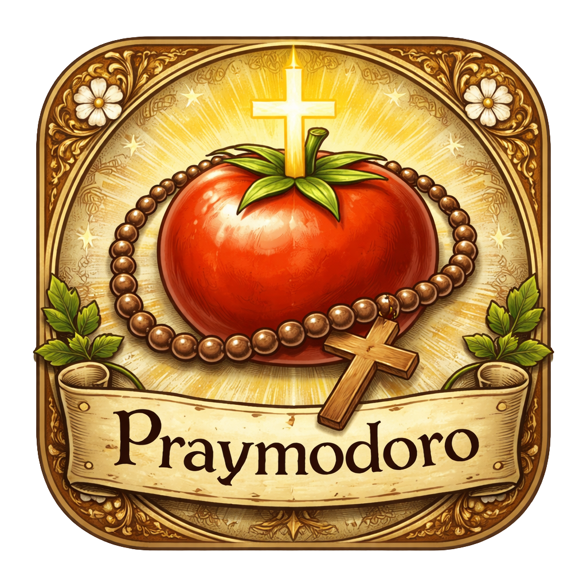

# Praymodoro

<p align="center">
  
</p>

<p align="center">
  <strong>A prayerful Pomodoro timer with adorable saint companions</strong>
</p>

<p align="center">
  
  
  
</p>

---

Praymodoro is a desktop Pomodoro timer that keeps you focused and faithful. A charming saint companion lives on your desktop, reading alongside you during work sessions and pausing to pray during breaks.

<table align="center">
  <tr>
    <td align="center">
      <br>
      <strong>St. Augustine of Hippo</strong>
    </td>
    <td align="center">
      <br>
      <strong>St. Thomas Aquinas</strong>
    </td>
  </tr>
  <tr>
    <td align="center">
      <br>
      <strong>St. Patrick</strong>
    </td>
    <td align="center">
      <br>
      <strong>St. Thomas More</strong>
    </td>
  </tr>
</table>
<p align="center">
  <em>Choose your study companion — they read during work and pray during breaks</em>
</p>

## Features

- **Clock-Synchronized Pomodoro** - Timer aligns with the hour so you can start anytime:
  - `:00-:25` Work (25 min)
  - `:25-:30` Break (5 min)
  - `:30-:55` Work (25 min)
  - `:55-:00` Break (5 min)

- **Desktop Companion** - A transparent, always-on-top character window that sits on your desktop
  - Drag anywhere on screen
  - Adjustable size and opacity
  - Reads during work, prays during breaks

- **System Tray Integration** - Quick access from the menu bar with live countdown display

- **Saint Characters** - Choose your study companion:
  - St. Augustine of Hippo
  - St. Thomas Aquinas
  - St. Patrick
  - St. Thomas More

- **Minimal & Unobtrusive** - Designed to help you focus, not distract

## Installation

### macOS (Homebrew)

```bash
brew tap JohnVonDrashek/tap
brew install --cask praymodoro
```

### Download

Pre-built binaries are available on the [Releases](https://github.com/JohnVonDrashek/praymodoro-forge/releases) page:
- **macOS**: `.dmg`
- **Windows**: `.exe`
- **Linux**: `.deb`, `.rpm`

### Building from Source

#### Prerequisites

- Node.js 18+
- npm

#### Development

```bash
# Clone the repository
git clone https://github.com/JohnVonDrashek/praymodoro.git
cd praymodoro

# Install dependencies
npm install

# Start the app in development mode
npm start
```

### Building for Production

```bash
# Package the app
npm run package

# Create distributable (DMG on macOS, EXE on Windows, DEB/RPM on Linux)
npm run make
```

Built packages will be in the `out/` directory.

## Usage

1. Launch Praymodoro - a saint companion will appear on your desktop
2. The timer automatically syncs to the current time within the Pomodoro cycle
3. Work when the countdown shows red, rest when it shows green
4. Access settings and controls from the system tray icon
5. Drag the character anywhere on your screen

### Tray Menu Options

- **Show/Hide** - Toggle the desktop companion
- **Character** - Switch between saints
- **Size** - Adjust companion size (50% - 200%)
- **Launch at Startup** - Start with your computer
- **Show in Dock** - Toggle dock icon visibility
- **Quit** - Exit the application

## Tech Stack

- [Electron](https://www.electronjs.org/) - Cross-platform desktop apps
- [Electron Forge](https://www.electronforge.io/) - Build tooling
- [TypeScript](https://www.typescriptlang.org/) - Type-safe JavaScript
- [Webpack](https://webpack.js.org/) - Module bundling

## Project Structure

```
praymodoro/
├── src/
│   ├── index.ts              # Main process entry
│   ├── main/
│   │   ├── time-controller.ts   # Pomodoro timer logic
│   │   ├── window-manager.ts    # Character window
│   │   ├── tray-manager.ts      # System tray
│   │   ├── settings-manager.ts  # Persistent settings
│   │   └── ipc-handlers.ts      # IPC communication
│   ├── renderer/
│   │   ├── renderer.ts       # UI logic
│   │   ├── index.html        # Character window HTML
│   │   └── styles.css        # Styling
│   ├── preload/
│   │   └── preload.ts        # Secure IPC bridge
│   └── shared/
│       ├── types.ts          # TypeScript types
│       └── constants.ts      # App constants
└── assets/
    ├── characters/           # Saint artwork
    └── icons/                # App & tray icons
```

## License

MIT License - see [LICENSE](LICENSE) for details.

## Acknowledgments

- Character artwork inspired by classical religious iconography
- The Pomodoro Technique by Francesco Cirillo

---

<p align="center">
  <em>"Thou hast made us for thyself, O Lord, and our heart is restless until it finds its rest in thee."</em>
  <br>
  <strong>— St. Augustine of Hippo, Confessions</strong>
</p>
